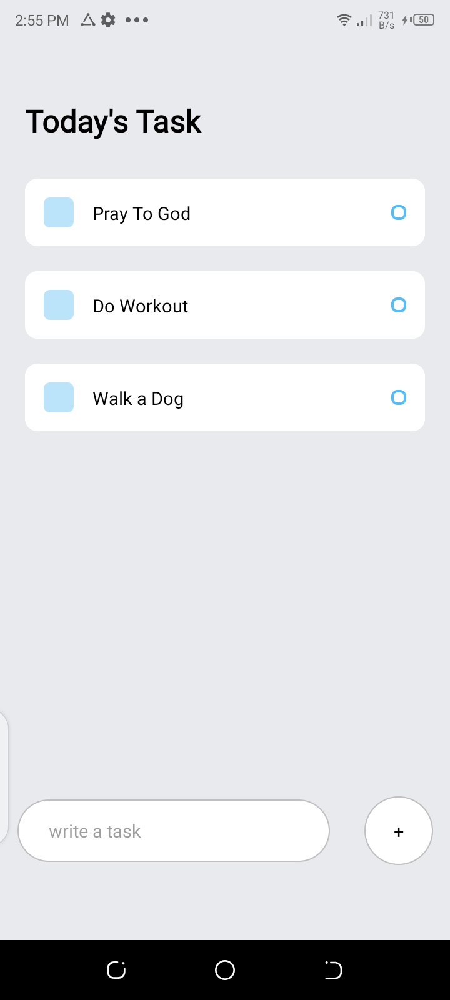

# Expo Todo List ReactNative App - By Desmond

Add todos or goals and can mark them as complete by simply tapping on one

## Image

## Available Scripts

In the project directory, you can run:

### `npm install`

To install dependencies and create node_modules folder

### `npm start or expo start`

to start the app
then use expo app to scan and view the app
